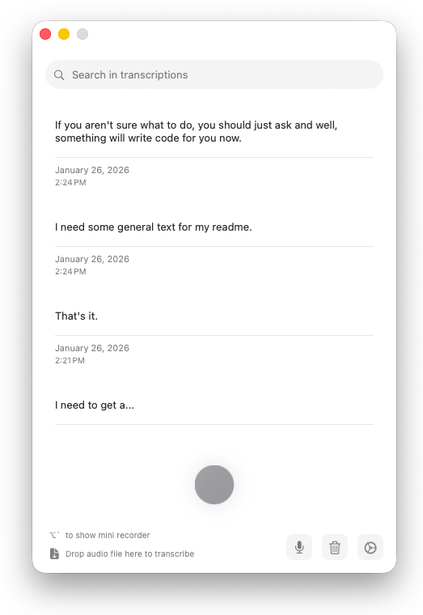

# OpenSuperWhisper

OpenSuperWhisper is a macOS application that provides real-time audio transcription using the Whisper model. It offers a seamless way to record and transcribe audio with customizable settings and keyboard shortcuts.

This is a fork of [Starmel/OpenSuperWhisper](https://github.com/Starmel/OpenSuperWhisper) with the following enhancements:

- **Visual Recording Indicator** – A larger, more prominent recording indicator with an animated waveform that displays real-time audio input levels, making it easy to see when you're recording and that your microphone is picking up sound.


- **Performance Optimizations** – Advanced settings to configure CPU core utilization for faster transcription, allowing you to leverage more processing power on multi-core machines.

<p align="center">
 
</p>

## Features

- 🎙️ Real-time audio recording and transcription
- 📊 Visual recording indicator with animated waveform display
- ⌨️ Global keyboard shortcuts for quick recording (use ```cmd + ` ```)
- 🌍 Support for multiple languages with auto-detection
- 🔄 Optional translation to English (for better translation add initial prompt with english sentences)
- 💾 Local storage of recordings with transcriptions
- ⚡ Advanced performance settings for multi-core CPU optimization
- 🇯🇵🇨🇳🇰🇷 Support for Asian languages with [auto-correct](https://github.com/huacnlee/autocorrect)

## Requirements

- macOS (Apple Silicon/ARM64)

## License

OpenSuperWhisper is licensed under the MIT License. See the [LICENSE](LICENSE) file for details.

## Whisper Models

You can download Whisper model files (`.bin`) from the [Whisper.cpp Hugging Face repository](https://huggingface.co/ggerganov/whisper.cpp/tree/main). Place the downloaded `.bin` files in the app's models directory. On first launch, the app will attempt to copy a default model automatically, but you can add more models manually.
